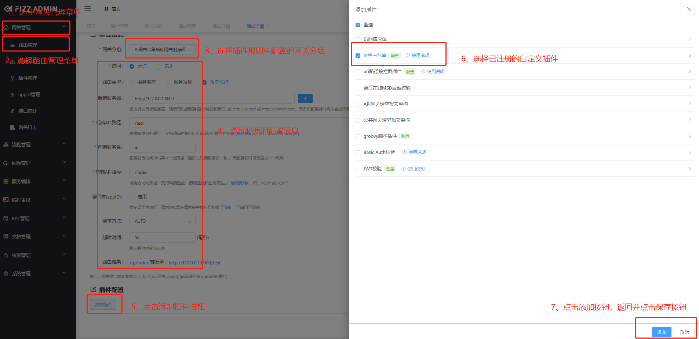
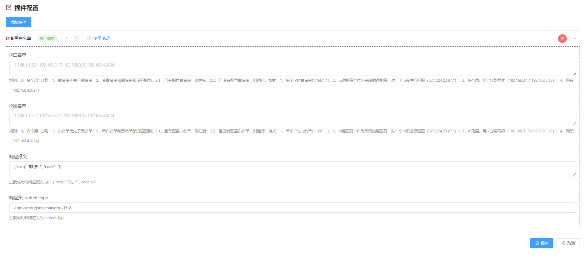

## 概述

基于fizz的插件机制，定制IP Filter Plugin，提供更加方便快捷的网关层面IP黑白名单过滤解决方案。

## 插件说明

IP Filter Plugin插件，是一个非常简单的插件，可以支持自定义设置黑名单IP和白名单IP，支持正向过滤和反向过滤。同时支持插件级别和路由级别的黑白名单配置。其中，匹配规则中白名单优先级高于黑名单，同时路由级别优先级配置高于插件级别配置。

## 使用说明
I、gateway项目pom文件中引入以下依赖：

```xml
<dependency>
  <groupId>com.fizzgate</groupId>
  <artifactId>fizz-plugin-ip</artifactId>
  <version>2.3.4-beta2</version>
</dependency>
```

II. 管理后台导入以下SQL

 ```sql
     INSERT INTO `tb_plugin` (`fixed_config`, `eng_name`, `chn_name`, `config`, `order`, `instruction`, `type`, `create_user`, `create_dept`, `create_time`, `update_user`, `update_time`, `status`, `is_deleted`) VALUES 
     ('{"configs":[{"gwGroup":"fizz-gateway-plugin-example","whiteIp":"","blackIp":"10.237.125.2,10.237.125.11"}]}', 'ipPlugin', 'IP黑白名单插件', '[{"field":"whiteIp","label":"IP白名单","component":"textarea","dataType":"string","placeholder":"1.168.1.1,52.*,192.168.3.17-192.168.3.38,192.168.4.0/24","desc":"规则：0、多个用‘,’分割；1、白名单优先于黑名单；2、若白名单和黑名单都没匹配到；2.1、且有配置白名单，则拦截；2.2、且没有配置白名单，则通行。格式：1、单个IP的白名单(1.168.1.1)；2、ip通配符'*'作为某段的通配符，对一个ip段进行匹配（52.*,224.23.87.*）；3、IP范围，用'-'分割两界（192.168.3.17-192.168.3.38）；4、网段（192.168.4.0/24）","rules":[]},{"field":"blackIp","label":"IP黑名单","component":"textarea","dataType":"string","placeholder":"1.168.1.1,52.*,192.168.3.17-192.168.3.38,192.168.4.0/24","desc":"规则：0、多个用‘,’分割；1、白名单优先于黑名单；2、若白名单和黑名单都没匹配到；2.1、且有配置白名单，则拦截；2.2、且没有配置白名单，则通行。格式：1、单个IP的白名单(1.168.1.1)；2、ip通配符'*'作为某段的通配符，对一个ip段进行匹配（52.*,224.23.87.*）；3、IP范围，用'-'分割两界（192.168.3.17-192.168.3.38）；4、网段（192.168.4.0/24）","rules":[]},{"field":"errorRespContent","label":"响应报文","component":"textarea","dataType":"string","default":"{\"msg\":\"非法IP\",\"code\":-1}","desc":"拦截成功时响应报文, 如：{\"msg\":\"非法IP\",\"code\":-1}","rules":[]},{"field":"errorRespContentType","label":"响应头content-type","component":"input","dataType":"string","default":"application/json;charset=UTF-8","desc":"拦截成功时响应头的content-type","rules":[]}]', 1, '规则：0、多个用‘,’分割；1、白名单优先于黑名单；2、若白名单和黑名单都没匹配到；2.1、且有配置白名单，则拦截；2.2、且没有配置白名单，则通行。格式：1、单个IP的白名单(1.168.1.1)；2、ip通配符'*'作为某段的通配符，对一个ip段进行匹配（52.*,224.23.87.*）；3、IP范围，用'-'分割两界（192.168.3.17-192.168.3.38）；4、网段（192.168.4.0/24）', 2, NULL, NULL, NULL, NULL, NULL, 1, 0);
 ```

更多网关二次开发请参考[网关快速开发](https://www.fizzgate.com/fizz/guide/fast-dev/fast-dev.html) 、[插件开发样例](https://www.fizzgate.com/fizz/guide/plugin/)

III、当需要对目标服务或路由做IP过滤时，可在Fizz Admin管理系统中网关管理->插件管理中配置IP Plugin插件来实现IP过滤。在使用前需要在 网关管理->插件管理 里配置访问的IP地址黑白名单，自定义路由级别黑白IP名单配置格式如下：

## IP名单配置规则说明
- 1、可配置多个或一个IP地址，多个IP中间用","分割。格式如下：
  - 1.1、单个IP的白名单(1.168.1.1)；
  - 1.2、ip通配符'*'作为某段的通配符，对一个ip段进行匹配（52.*,224.23.87.*）；
  - 1.3、IP范围，用'-'分割两界（192.168.3.17-192.168.3.38）；
  - 1.4、网段（192.168.4.0/24）
- 2、白名单优先级高于黑名单；
- 3、若白名单和黑名单都有匹配到，且有配置白名单，则通行；且没有配置白名单，则拦截。

**表单定义->路由级别的自定义属性，代码示例：com.ol.fizz.plugin.ip.RouterConfig**
```json
[
  {
    "field": "whiteIp",
    "label": "IP白名单",
    "component": "textarea",
    "dataType": "string",
    "placeholder": "1.168.1.1,52.*,192.168.3.17-192.168.3.38,192.168.4.0/24",
    "desc": "规则：0、多个用‘,’分割；1、白名单优先于黑名单；2、若白名单和黑名单都没匹配到；2.1、且有配置白名单，则拦截；2.2、且没有配置白名单，则通行。格式：1、单个IP的白名单(1.168.1.1)；2、ip通配符'*'作为某段的通配符，对一个ip段进行匹配（52.*,224.23.87.*）；3、IP范围，用'-'分割两界（192.168.3.17-192.168.3.38）；4、网段（192.168.4.0/24）",
    "rules": []
  },
  {
    "field": "blackIp",
    "label": "IP黑名单",
    "component": "textarea",
    "dataType": "string",
    "placeholder": "1.168.1.1,52.*,192.168.3.17-192.168.3.38,192.168.4.0/24",
    "desc": "规则：0、多个用‘,’分割；1、白名单优先于黑名单；2、若白名单和黑名单都没匹配到；2.1、且有配置白名单，则拦截；2.2、且没有配置白名单，则通行。格式：1、单个IP的白名单(1.168.1.1)；2、ip通配符'*'作为某段的通配符，对一个ip段进行匹配（52.*,224.23.87.*）；3、IP范围，用'-'分割两界（192.168.3.17-192.168.3.38）；4、网段（192.168.4.0/24）",
    "rules": []
  },
  {
    "field": "errorRespContent",
    "label": "响应报文",
    "component": "textarea",
    "dataType": "string",
    "default": "{\"msg\":\"非法IP\",\"code\":-1}",
    "desc": "拦截成功时响应报文, 如：{\"msg\":\"非法IP\",\"code\":-1}",
    "rules": []
  },
  {
    "field": "errorRespContentType",
    "label": "响应头content-type",
    "component": "input",
    "dataType": "string",
    "default": "application/json;charset=UTF-8",
    "desc": "拦截成功时响应头的content-type",
    "rules": []
  }
]
```

##### 参数说明

|参数名|说明|
|:----    |-----   |
| whiteIp | IP白名单配置，规则参考：json样例中对应item的rules字段属性  |
| blackIp | IP黑名单配置，规则参考：json样例中对应item的rules字段属性  |
| errorRespContent | 错误响应内容：默认：{"msg":"非法IP","code":-1} |
| errorRespContentType | 错误响应内容类型： 默认：application/json;charset=UTF-8|


- 备注
  定义规范参考官方新增插件中的相关表单规范说明描述，[Fizz Gateway -> 插件管理 -> 新增插件 -> 表单定义](http://fizzgate.com/guide/manager/manager_plugin.html#%E6%A6%82%E8%BF%B0)

**自定义配置->插件级别的自定义配置， 代码示例：com.ol.fizz.plugin.ip.PluginConfig**

```json
{
  "configs": [
    {
      "gwGroup": "fizz-gateway-plugin-example",
      "whiteIp": "",
      "blackIp": "10.237.209.56,10.237.209.157"
    }
  ]
}
```

##### 参数说明

|参数名|类型|说明|
|:---- |:----- |-----   |
| configs |array  | 插件级别的自定义配置信息  |

##### config参数说明

|参数名|类型|说明|
|:---- |:----- |-----   |
| gwGroup | string  | 网关所属组  |
| whiteIp | string  | 白名单  |
| blackIp | string  | 黑名单  |

**IP Filter Plugin配置图如下：**


- 备注
  - 1、注册插件时，插件名称必须与bean名称一致，否则无法注册成功，如：bean name是ipPlugin，则注册插件时插件名称即为ipPlugin。
  - 2、如需单独指定gwGroup，请先在Fizz Admin管理系统中网关管理->网关分组中配置新增自定义网关分组信息，这里不做赘述。


III、当IP Plugin注册成功后，可在Fizz Admin管理系统中网关管理->路由管理中新增配置IP Plugin插件来实现IP路由过滤。
- 1、选择自定义配置配置中的gwGroup指定网关集群
- 2、指定访问方式、路由类型、后端服务IP和端口或域名等信息
- 3、插件配置，选中已注册的IP Plugin插件保存

  保存路由配置成功后，访问指定的服务路由地址时，如果在IP白名单中匹配或黑名单未匹配到则通过，继续调用后端服务处理相关业务逻辑，否则返回错误报文。

**异常报文返回示例**
```json
{"msg":"非法IP","code":-1}
```
**新增路由配置图如下：**



**IP Filter Plugin配置预览图如下：**



